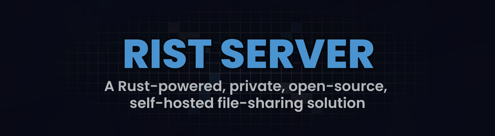

# RIST Server

RIST is a Rust-powered, private, open-source, self-hosted file-sharing solution.

## Features

- **Fast Performance**: The Rust backend server and raw frontend provide fast page loads and upload speeds.
- **Reliable**: The server is designed to be stable and resilient, returning errors when issues occur instead of crashing.
- **Secure Access**: You can set up authorized users, ensuring that only approved individuals can access the server.
- **Self-hosting Friendly**: RIST can be easily hosted on any Linux server (see [Self-hosting](#self-hosting) for more details).
- **YouTube Support**: The server can download videos from YouTube using the yt-dlp library.


## Self hosting

This project is primarily intended for home-hosted or private file-sharing use cases. Follow the steps below to get started with self-hosting.

### Prerequisites

Ensure that you have the following prerequisites installed:
- Rust 1.79 or later
- `libsqlite3` C library
- At least 2GB of storage (only for the server image)
- Internet access (not required if using the server in a local environment and only the file upload feature)

### Docker

> [!NOTE]
> The Docker support for this project is still in the testing stage and may not work properly. We recommend [hosting the server normally](#normal-deployment) for a more reliable setup.

#### Start RIST

You have to first obtain the `docker-compose.yaml` file. You can download it from github (here).

or

```sh
curl -o docker-compose.yaml https://raw.githubusercontent.com/oxydien/rist/main/docker-compose.yaml
```

Then simply launch the composer:

```sh
docker compose -p rist -f docker-compose.yaml up -d
```

#### Stop RIST

If you want to stop running RIST, just type

```sh
docker compose -p rist -f docker-compose.yaml down
```

### Normal deployment

Hosting RIST server from source is probably the easiest and most customizable option. To get started, follow these steps:

1. Clone the GitHub repository:
    ```sh
    git clone https://github.com/oxydien/rist.git
    ```

2. Build the server (this may take a few minutes):
    ```sh
    cargo build --release

    cp -r ./frontend ./target/release/
    ```

3. Run the server:
    ```sh
    cd ./target/release/

    ./rist
    ```

And that is it! If you want to run this server in the background, you can try running it in tmux.

## Contributions

Contributions to the RIST project are welcome and encouraged! If you would like to contribute, please follow these guidelines:

1. Fork the repository and create a new branch for your changes.
2. Make your modifications and ensure that the code adheres to the project's coding standards.
3. Update the documentation, including the README, to reflect your changes.
4. Submit a pull request, providing a clear description of the changes and the problem they solve.

The project maintainers will review your contribution and provide feedback. Once your changes are approved, they will be merged into the main codebase.

If you encounter any issues or have ideas for new features, please feel free to open an issue on the project's GitHub repository. The maintainers will address them as soon as possible.

## License

This project is licensed under the [MIT License](./LICENSE)
